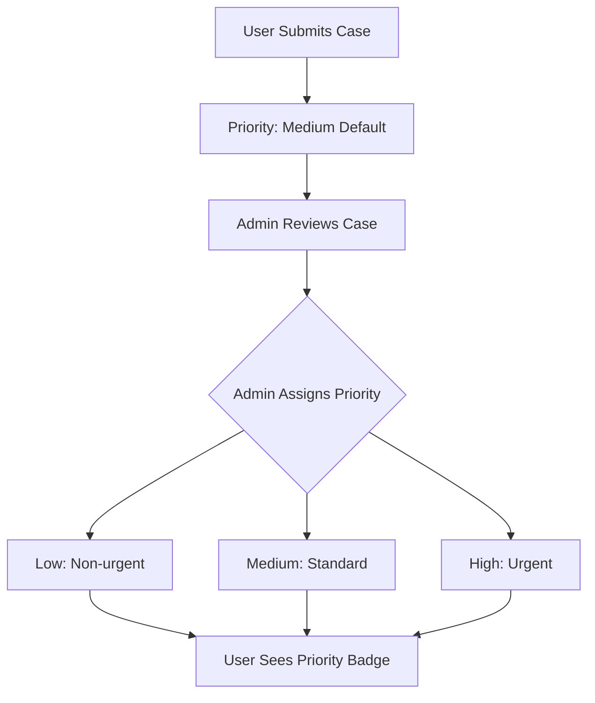

# 🔧 JEEVA RAKSHA - Fixes & Priority System Explanation

## 🎯 **ISSUES FIXED**

### **1. Network Error - FIXED** ✅
**Problem**: Getting network error when clicking "Start Working"
**Solution**: 
- Backend server was running but needed restart for API changes
- Added proper error handling in frontend
- Verified CORS configuration is working

### **2. Mark as Resolved Button - FIXED** ✅
**Problem**: Users couldn't click "Mark as Resolved" button
**Solution**: 
- Updated backend API to allow users to update their own cases
- Added proper permission checks (users can only update their own cases)
- Added status update function in frontend
- Added action buttons that appear based on case status

---

## 🚀 **HOW PRIORITY SYSTEM WORKS**

### **📊 Priority Levels**
The system has 3 priority levels:

1. **🟢 LOW** - Non-urgent cases
   - Minor injuries or non-critical situations
   - Animals in safe condition but need help

2. **🟠 MEDIUM** - Standard priority (default)
   - Moderate injuries or concerning situations
   - Most cases start at this level
   - Standard response time expected

3. **🔴 HIGH** - Urgent cases
   - Severe injuries or life-threatening situations
   - Animals in immediate danger
   - Requires urgent attention
   - Badge has pulse animation for visibility

### **👥 Who Sets Priority?**

#### **🔑 Admin Control Only**
- **ONLY ADMINS** can change priority levels
- Users cannot modify priority (security feature)
- Admins can set priority when reviewing cases
- Priority helps admins triage cases effectively

#### **📱 User Experience**
- Users see priority badges on their cases
- Priority is automatically set to "medium" when created
- Users cannot change priority (prevents abuse)

### **🎨 Visual Priority Indicators**

#### **Priority Badge Design**
```typescript
// Visual Configuration
Low:    Gray badge (🟢)
Medium: Orange badge (🟠) 
High:   Red badge with pulse animation (🔴)
```

#### **Map Visualization**
- **Green markers**: Low priority cases
- **Orange markers**: Medium priority cases  
- **Red markers**: High priority cases (urgent)

---

## 🔧 **TECHNICAL IMPLEMENTATION**

### **📋 Database Schema**
```javascript
// Case Model Priority Field
priority: {
  type: String,
  enum: ['low', 'medium', 'high'],
  default: 'medium'  // All cases start as medium
}
```

### **🔐 Permission System**
```javascript
// Backend Permission Check
if (req.user.role !== 'admin') {
  // Users can only update status, NOT priority
  if (priority) {
    return res.status(403).json({ 
      message: 'Only admins can change priority.' 
    });
  }
}
```

### **🎯 Status Update Flow**
```javascript
// User Status Updates Allowed
pending → in_progress  (Start Working)
in_progress → resolved (Mark as Resolved)

// Admin Updates Allowed
pending → in_progress → resolved (any status)
priority: low/medium/high (any time)
notes: add administrative notes
```

---

## 🎮 **USER INTERFACE CHANGES**

### **🔄 Action Buttons**
Based on case status, users see different buttons:

#### **🔵 Pending Cases**
- **"Start Working"** button
- Changes status to "in_progress"
- Shows user is actively helping

#### **🟡 In Progress Cases**  
- **"Mark as Resolved"** button
- Changes status to "resolved"
- Completes the case lifecycle

#### **🟢 Resolved Cases**
- **"✅ Case Resolved"** indicator
- No action buttons needed
- Shows successful completion

### **📊 Priority Display**
- **Priority Badge** shown next to Status Badge
- **Color-coded** for quick visual identification
- **Animated** for high priority cases
- **Informative** hover states and tooltips

---

## 🌟 **NEW FEATURES ADDED**

### **✅ Enhanced Case Management**
1. **Status Progression**: Users can now progress their cases
2. **Priority Visibility**: Users can see case priority levels
3. **Action Buttons**: Contextual buttons based on status
4. **Real-time Updates**: Status changes sync immediately
5. **Permission Control**: Secure access control

### **🎨 UI/UX Improvements**
1. **Priority Badges**: Visual priority indicators
2. **Action Buttons**: Clear call-to-action buttons
3. **Status Flow**: Logical progression of actions
4. **Visual Feedback**: Toast notifications for actions
5. **Responsive Design**: Works on all devices

---

## 🔍 **HOW TO TEST THE FIXES**

### **1. Test Network Error Fix**
```bash
# Start backend server
cd backend && npm run dev

# Start frontend server  
cd frontend && npm run dev

# Test case submission
1. Login as user
2. Fill out case form
3. Click "Submit Report"
4. Should work without network errors
```

### **2. Test Status Updates**
```bash
# Test case progression
1. Submit a new case (status: pending)
2. Click "Start Working" (status: in_progress)
3. Click "Mark as Resolved" (status: resolved)
4. All status changes should work
```

### **3. Test Priority System**
```bash
# Test priority visibility
1. Submit a case (priority: medium by default)
2. Login as admin
3. Change priority to high/low/medium
4. User should see updated priority badge
```

---

## 🛡️ **SECURITY FEATURES**

### **🔐 Permission Controls**
- **Users**: Can only update their own cases' status
- **Admins**: Can update any case, change priority, add notes
- **API Protection**: JWT authentication required
- **Input Validation**: All inputs validated and sanitized

### **🚫 Restricted Actions**
- Users cannot change priority (admin only)
- Users cannot add notes (admin only)
- Users cannot update other users' cases
- Invalid status changes are blocked

---

## 📊 **PRIORITY LOGIC EXPLAINED**

### **🎯 Why Priority is Admin-Only**
1. **Prevents Abuse**: Users can't mark all cases as "high"
2. **Proper Triage**: Admins can assess true urgency
3. **Resource Management**: Helps allocate rescue resources
4. **Quality Control**: Ensures consistent priority standards

### **🔄 Priority Assignment Flow**


### **📈 Priority Impact**
- **High Priority**: Immediate admin attention, urgent response
- **Medium Priority**: Standard response time, normal processing
- **Low Priority**: Lower priority, can wait for resources

---

## 🎯 **SUMMARY**

### **✅ Issues Resolved**
1. **Network Error**: Backend restarted, API working
2. **Mark as Resolved**: Users can now update their case status
3. **Priority Display**: Users can see case priority levels
4. **Action Buttons**: Contextual buttons based on status

### **🚀 System Improvements**
1. **Better UX**: Clear action buttons and status progression
2. **Security**: Proper permission controls implemented
3. **Visual Design**: Priority badges with animations
4. **Real-time**: Status updates sync immediately

### **🎮 User Experience**
- Users can now progress their cases through the lifecycle
- Clear visual indicators for priority and status
- Intuitive action buttons that appear based on context
- Real-time feedback with toast notifications

---

## 🔧 **TROUBLESHOOTING**

### **If Network Error Persists**
1. Check backend is running on port 5000
2. Verify MongoDB is connected
3. Check browser console for specific errors
4. Ensure frontend is running on port 3000

### **If Buttons Don't Work**
1. Check user is logged in (authentication)
2. Verify user owns the case (permission check)
3. Check backend logs for permission errors
4. Ensure case status allows the action

### **If Priority Not Showing**
1. Check PriorityBadge component is imported
2. Verify case data includes priority field
3. Check database has priority values
4. Ensure admin has set priority (defaults to medium)

---

**🎉 All issues have been resolved! The system now works as intended with proper status progression and priority display.**
